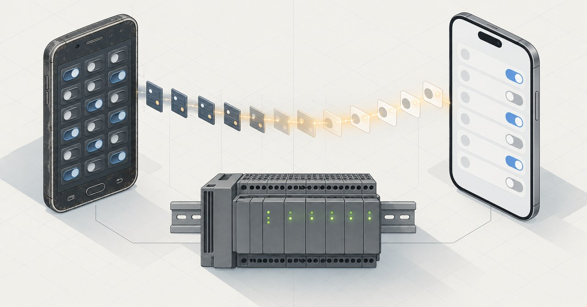

# Virtuino 6 → Virtuino IoT project migrator



Migrate light-switch dashboards from the legacy **Virtuino 6** Android app
(`.vrt6` files) to the new cross-platform **Virtuino IoT** app (`.vrt7` files).

There is no official conversion path between the two apps: Virtuino IoT is a
complete rewrite with a different project format, so users are expected to
rebuild their dashboards by hand. If your project has dozens of widgets
(mine had 37 Modbus switches for home lighting on Siemens LOGO! PLCs), that
is a lot of tapping. This tool automates it.

Both file formats turned out to be **SQLite databases**, so the migration is
"just" reading one schema and writing another. The schemas are documented in
[docs/FORMAT.md](docs/FORMAT.md) — as far as I know, the only public notes on
these formats.

## What it does

- Reads Modbus TCP servers, panels, digital-output switches and text labels
  from a `.vrt6` project
- Matches each switch with its nearest text label (labels are separate
  widgets in Virtuino 6)
- Rebuilds everything in a `.vrt7` project: connections with Modbus unit IDs
  carried over, one variable per switch (coil, FC01/05), and a clean
  label-plus-switch row layout on each dashboard

## What it cannot do (yet)

- Charts, gauges, sliders, MQTT connections, analog registers — only
  coil-type switches are migrated
- **IP addresses.** Virtuino IoT encrypts server IPs inside the project file
  with a key I did not try to extract. This is why a *template* file is
  required, and why you must re-type the IP of every connection after import
  (30 seconds in the app)

## Usage

**Step 1 — make a template.** In the Virtuino IoT app create a new project,
add one Modbus TCP connection (with your real PLC IP), one Button widget and
one Label widget. Export the project.

**Step 2 — run the migrator** (Python 3, no dependencies):

```bash
python3 migrate.py my_old_project.vrt6 --template template.vrt7 -o migrated.vrt7
```

**Step 3 — import `migrated.vrt7`** in Virtuino IoT, then:

1. Open every connection and re-type its IP address (see above).
2. Test **one** switch against the real PLC before trusting all of them.

Fun fact: importing a generated file also works in the **free** version of
Virtuino IoT, which normally limits how many widgets you can add by hand.

## Tested with

- Virtuino 6 project, schema `user_version=102`
- Virtuino IoT project, schema `user_version=23` (2026)
- Siemens LOGO! 8.3 over Modbus TCP, coils 8256–8275 (network flags M1–M20)

Other app versions may use different schema versions — open an issue with
your file's `PRAGMA user_version` if the import fails.

## Disclaimer

This is a community reverse-engineering effort, not affiliated with
Virtuino or its developer. Back up your projects. Widgets that write to a
PLC can switch real equipment — always verify addresses on one widget
before trusting a migrated project.

## License

MIT
